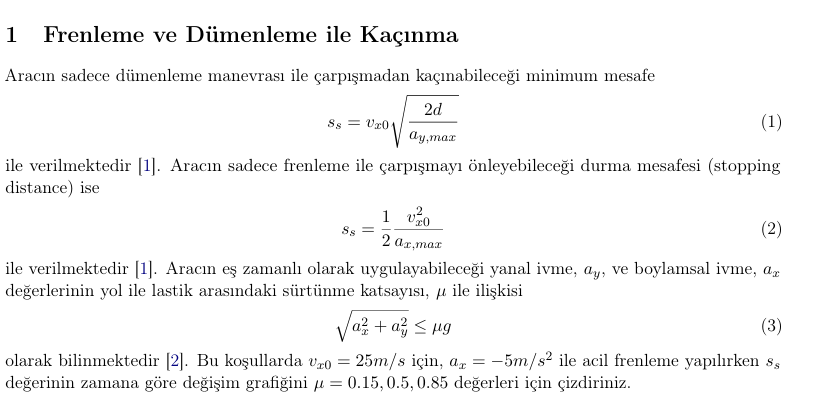

# ADAS Systems

A collection of Python simulations modelling core **Advanced Driver-Assistance
System (ADAS)** functions. Each task implements the underlying physics/control
equations from scratch (NumPy + SciPy) and visualises the behaviour with
Matplotlib.

The goal is educational: to show *how* common ADAS features work mathematically,
how their tuning parameters affect behaviour, and where the comfort/safety
trade-offs lie.

## Tasks

| Task | Topic | Key idea |
|------|-------|----------|
| [Task-1](Task-1/) | Collision avoidance: brake vs. steer | Friction-circle limit on braking and lateral manoeuvres |
| [Task-2](Task-2/) | Minimum-jerk trajectory planning | Quintic polynomial + weighted cost optimisation |
| [Task-3](Task-3/) | Lateral path tracking | Feedback controller vs. Pure Pursuit |
| [Task-4](Task-4/) | Smart Speed Assistant | Curvature- and regulation-based speed adaptation |

## Setup

```bash
python -m venv .venv
source .venv/bin/activate        # Windows: .venv\Scripts\activate
pip install -r requirements.txt
```

> **Note on plotting backend:** each script auto-selects an available
> interactive Matplotlib backend at startup — `MacOSX` first on macOS (since
> Tkinter is often missing there), then `QtAgg`, `TkAgg`, and finally the
> non-interactive `Agg` so the scripts also run headless / in CI. Override with
> the `MPLBACKEND` environment variable, e.g. `MPLBACKEND=Agg python Task-1/main.py`.

Run any task directly:

```bash
python Task-1/main.py
python Task-2/main.py
python Task-3/main.py
python Task-4/main.py
```

---

## Task-1 — Collision Avoidance: Braking vs. Steering

Given an initial speed `v0` and a road friction coefficient `μ`, the script
compares two emergency manoeuvres.

**Braking distance** (constant deceleration `a`):

```
s_stop = v0² / (2·|a|)
```

The achievable deceleration is capped by the friction limit `|a| ≤ μ·g`.

**Steering avoidance** uses the *friction circle*. Two cases are plotted:

- **Pure steering (`d2`)** — no braking, so the full friction is available
  laterally:

  ```
  s_steer,pure = v0 · √(2·d / (μ·g))
  ```

- **Combined braking + steering (`d3`)** — brake at `a` and use the *remaining*
  friction laterally:

  ```
  a_lat = √((μ·g)² − a²)
  s_steer,comb = v0 · √(2·d / a_lat)
  ```

where `d` is the lateral clearance needed to avoid the obstacle. When braking
already saturates the tyres (`|a| = μ·g`), no lateral capacity remains and the
combined manoeuvre is "not possible". This mirrors the critical-distance
hierarchy in the collision-avoidance literature (`d1` braking-only ≥ `d3`
combined ≥ `d2` steering-only at high speed).



## Task-2 — Minimum-Jerk Trajectory Planning

The ego vehicle's longitudinal trajectory is modelled as a **fifth-degree
(quintic) polynomial**:

```
s(t)  = a0 + a1·t + a2·t² + a3·t³ + a4·t⁴ + a5·t⁵
v(t)  = s'(t)
a(t)  = s''(t)
j(t)  = s'''(t)        (jerk → ride comfort)
```

The initial conditions fix `a0 = s0`, `a1 = v0`, `a2 = a_c0/2`; the remaining
coefficients `a3, a4, a5` are found by minimising a weighted cost:

```
C = k_j · (comfort/jerk cost) + k_t · (time/speed-tracking cost) + k_s · (position cost)
```

- `k_j` — weight on jerk (comfort)
- `k_t` — weight on speed/acceleration smoothness (time efficiency)
- `k_s` — weight on reaching the target gap behind the lead vehicle

The target gap follows a constant time-headway model:

```
s_target = s_lead(T) − (D0 + τ·v_lead)
```

The initial guess for the optimiser is the closed-form quintic that reaches the
target position with the lead-vehicle speed and zero acceleration at the horizon
`T`. Optimisation tries BFGS / Nelder–Mead / Powell (SLSQP fallback) and keeps
the best result.

A parameter sweep over `k_j`, `k_t`, `k_s` shows the trade-offs:

| Parameter | Increasing it… |
|-----------|----------------|
| `k_j` | smoother (more comfortable) ride, but more deviation from the target |
| `k_s` | hits the target gap accurately, but jerk/acceleration become aggressive |
| `k_t` | mostly raises total cost; little effect on behaviour |

_k_j.png)

Use `Task-2/visualize_methods.py` to plot per-iteration convergence from the
CSV logs written to `Task-2/opt_logs/`.

## Task-3 — Lateral Path Tracking

A double-tanh reference path models a lane change, then two steering controllers
are compared on a kinematic bicycle model with first-order steering lag:

```
ṙ   = (−r + v·κ_cmd) / τ        (yaw-rate dynamics)
ψ̇   = r
Ẋ   = v·cos(ψ),   Ẏ = v·sin(ψ)
```

- **Feedback controller** — commands curvature from the lateral error `e_y` and
  heading error `e_ψ`:

  ```
  κ_cmd = k_y · e_y + k_ψ · e_ψ
  ```

- **Pure Pursuit** — picks a look-ahead point on the path and steers toward it:

  ```
  κ_cmd = 2·sin(α) / L_d
  ```

The script sweeps look-ahead distance and gains, reporting tracking RMSE for
each. Tune `k_y`, `k_ψ` and the look-ahead distance to trade off responsiveness
vs. stability.

## Task-4 — Smart Speed Assistant

Plans a comfortable speed profile along a road with varying curvature and legal
speed limits. Two limits are combined:

**Curvature limit** (bounded lateral acceleration):

```
v_lim,road = √(a_y,comfort / κ)
```

**Regulatory limit** — per-segment posted speed.

```
v_lim = min(v_lim,road, v_lim,traffic)
```

The assistant looks ahead and, if a lower limit is approaching, begins a
comfortable deceleration once within the trigger distance:

```
d_trig = (v² − v_lim²) / (2·|a_x,comfort|)
```

The longitudinal dynamics `[ṡ, v̇] = [v, a_des]` are integrated with
`scipy.integrate.solve_ivp`. Different comfort settings (`a_x_comfort`,
`a_y_comfort`) are compared, including a degenerate "no comfort limit" case.

---

## Project structure

```
Task-1/   collision avoidance (braking vs steering)
Task-2/   quintic minimum-jerk trajectory optimisation
          ├─ visualize_methods.py   convergence plots from opt_logs/
          └─ opt_logs/              generated CSV logs (git-ignored)
Task-3/   lateral path tracking (feedback vs pure pursuit)
Task-4/   smart speed assistant
```

## License

Released under the MIT License — see [LICENSE](LICENSE).
