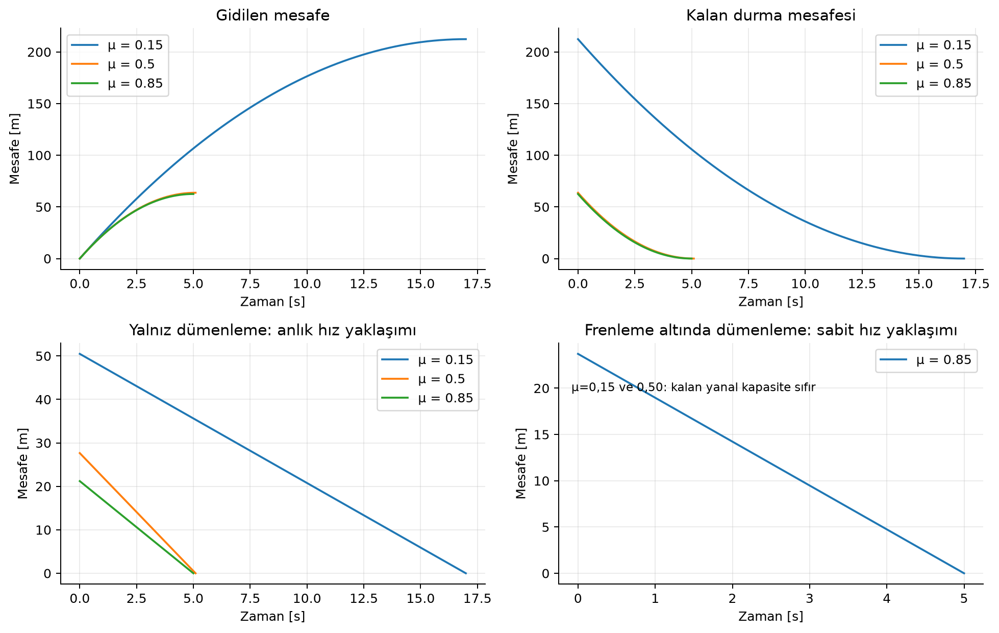
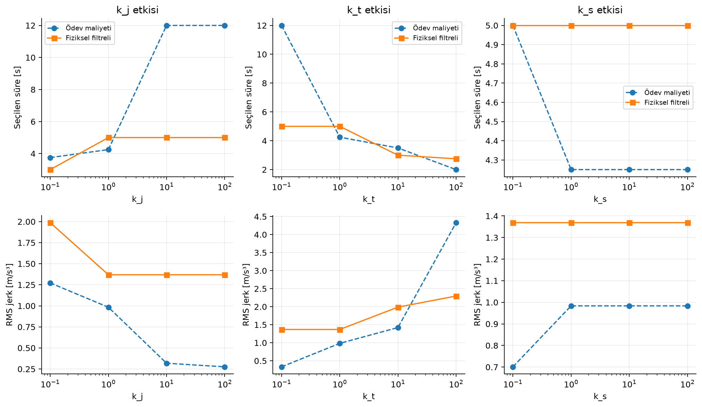
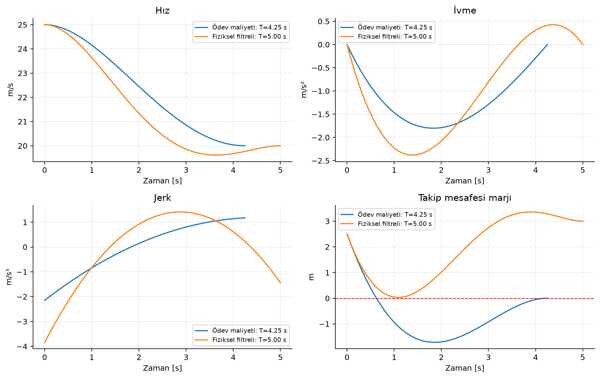
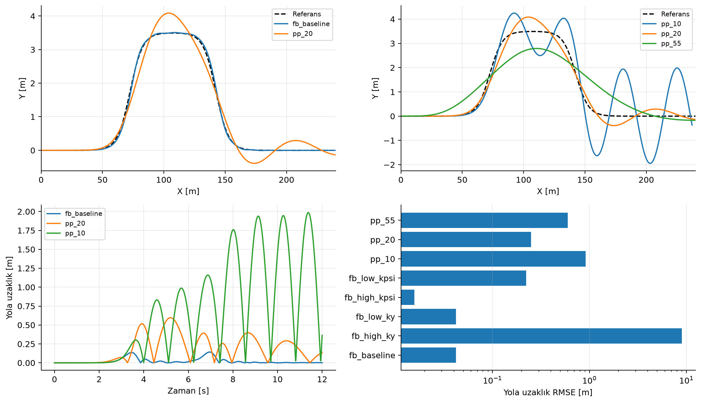
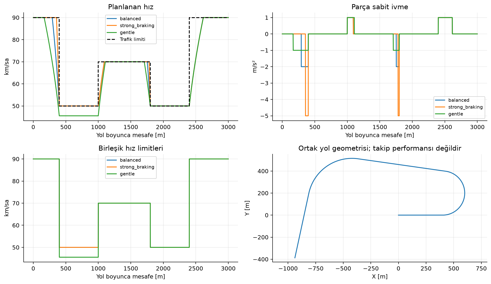

# Hareket Planlama ve Kontrol

ADAS ödevi için uçtan uca referans çözüm • Türkçe teknik rapor • Sürüm 1.0

Amaç: Verilen dört görevi açık varsayımlar, tekrar üretilebilir deneyler ve ölçülebilir doğrulama ile çözmek. Bu çalışma, önceki teslimin düzeltilmiş kopyası yerine ayrı bir uygulamadır. Grafikler ve tablolar bu klasördeki kodun kaydedilmiş çıktılarından üretilmiştir.

### Çözümün ana kararları

| Görev | Uygulanan yöntem | Doğrulama |
| --- | --- | --- |
| 1 - Frenleme | Sürtünmeyle sınırlı ivme; gidilen ve kalan mesafenin ayrılması | Analitik durma mesafesi ve sürtünme çemberi |
| 2 - Yörünge | Farklı süre / son konum adayları; altı sınır koşullu quintic | Analitik jerk integrali; sürekli aralıkta ekstremumlar |
| 3 - Şerit değiştirme | Aynı yaw-rate gecikmesi üzerinde Feedback ve Pure Pursuit | Ortak geometrik hata; zaman/yol adımı hassasiyeti |
| 4 - Hız asistanı | Gelecek limitlerden geriye frenleme, ileriye hızlanma zarfı | Her yol aralığında hız ve ivme koşulları; uygulanabilirlik |

### Bu çalıştırmadan öne çıkan sonuçlar

Task-2: 1271 adayın 77 tanesi açıklanan fiziksel filtreyi geçti. Orijinal maliyet seçiminin süresi 4.25 s, filtreli seçimin süresi 5.00 s oldu. Bu değerler yalnızca tanımlanan sonlu aday kümesi için optimumdur.

Task-4: Beş senaryonun 3 tanesi uygulanabilir bulundu. Çok düşük ve sıfır frenleme kapasitesiyle başlayan senaryolar başarılı gibi gösterilmedi.

Analitik referans ve sınır durumlarını içeren 17 otomatik test geçti. Bu kontroller uygulamanın belirtilen modele uygunluğunu ölçer; gerçek araç güvenliği veya sertifikasyon kanıtı değildir.

Okuma sırası: model kararları ve sonuçlar → doğrulama → çalıştırma ve kaynaklar. Kod ve ham veriler raporun yanında teslim edilir.


---

## 01 / Frenleme ve dümenleme

Kaynak: ödev, bölüm 1, denklemler (1)-(3). Başlangıç hızı 25 m/s, talep edilen fren ivmesi -5 m/s², g=9,81 m/s². Verilmeyen yanal açıklık için d=3 m seçildi. Tepki süresi, araç boyutları ve direksiyon geçişi model dışında tutuldu.

```text
b = min(5, μg); v(t) = max(v₀ - bt, 0)
s(t) = v₀t - bt²/2; s_kalan(t) = v(t)²/(2b)
a_y,kalan = sqrt((μg)² - b²); s_dümenleme = v sqrt(2d/a_y)
```

Fren ivmesi bir talep olarak yorumlandı. μ=0,15 ve 0,50 için tam -5 m/s² fiziksel olarak mümkün değildir. μ=5/g≈0,5097 eşiktir. Gidilen mesafe artarken kalan durma mesafesi azalır; bunlar aynı grafik başlığı altında karıştırılmadı.

| μ | Gerçek fren [m/s²] | Durma süresi [s] | Durma mesafesi [m] |
| --- | --- | --- | --- |
| 0.15 | -1.472 | 16.989 | 212.368 |
| 0.50 | -4.905 | 5.097 | 63.710 |
| 0.85 | -5.000 | 5.000 | 62.500 |



Sağ alt grafik, ödevin sabit boylamsal hız yaklaşımını kalan yanal kapasiteye uygular; gerçek birleşik manevra simülasyonu değildir. Frenleme sürerken x=v₀t-bt²/2 düzeltmesi ayrıca CSV özeti içinde verilir ve yalnızca yanal kaçış durmadan önce tamamlanıyorsa geçerli sayılır. Sürtünme doyumunda yanal kapasite sıfırdır; bu, freni azaltarak yapılabilecek başka bir manevranın da imkânsız olduğu anlamına gelmez.


---

## 02 / Yörünge: matematik ve adaylar

Kaynak: ödev, bölüm 2, denklemler (4)-(9). Ego başlangıcı [0 m,25 m/s,0 m/s²], öndeki araç [50 m,20 m/s,0 m/s²]. D₀=10 m ve τ=1,5 s açık tasarım seçimleridir. Öndeki araç sabit hızlıdır.

```text
s_hedef(T) = 50 + 20T - (10 + 1,5×20) = 10 + 20T
s(T) = s_hedef(T) + Δs; v(T) = 20; a(T) = 0
C = k_j J + k_t T + k_s Δs²; J = integral₀ᵀ j(t)² dt
```

Ödevde s_d ayrı tanımlanmadığından s_d=s_hedef(T) kabul edildi. Böylece son konum cezası Δs² olur. Süreyi sabitlemek yerine T=2...12 s (0,25 s adım) ve Δs=-20...10 m (1 m adım) tarandı. Her aday altı sınır koşulunu tam sağlar; serbest katsayıları gelişigüzel değiştirerek son hız/ivme koşulları bozulmaz.

### Sayısal koşullandırma

```text
u=t/T; q(u)=b₀+b₁u+b₂u²+b₃u³+b₄u⁴+b₅u⁵
b₀=s₀; b₁=T v₀; b₂=T²a₀/2
[1 1 1; 3 4 5; 6 12 20] [b₃ b₄ b₅]ᵀ = son koşul artıkları
```

Zaman u∈[0,1] aralığına taşındı; matris T ile kötü ölçeklenmez. Fiziksel türevler q′/T, q″/T² ve q‴/T³ olarak hesaplanır. Jerk karesi polinomu tam olarak integre edilir. Sayısal integral veya rastgele başlangıç gerekmiyor.

### Ödev çözümü ile güvenlik uzantısı ayrı

İlk seçim yalnızca ödev maliyetini minimize eder. İkinci seçim aynı maliyeti, tanımlanan fiziksel koşulları geçen adaylar arasında minimize eder. Ek filtre ödevin maliyet denkleminde zorunlu değildir; güvenli sonuç iddiasını ayrıca sınamak amacıyla eklenmiştir.

```text
v(t) ≥ 0; -5 ≤ a(t) ≤ 2 m/s²; |j(t)| ≤ 5 m/s³
s_lead(t)-s_ego(t) ≥ D₀ + τv_ego(t)
```

Bunlar sürekli zaman aralığında denetlenir: her polinomun türevinin gerçek kökleri ve uç noktaları değerlendirilir. Sadece 20 veya 100 zaman örneğinde kontrol yapılmaz. Sayısal kök hesabı ve 10⁻⁸ tolerans kullanıldığı için bu, sembolik bir ispat değildir.

J birimi m²/s⁵, T birimi s, konum karesi birimi m²’dir. Toplam maliyetin boyutsuz sayılması istenirse k_j, k_t, k_s sırasıyla s⁵/m², 1/s ve 1/m² birimleri taşır. Gizli normalizasyon kullanılmadı; ağırlık değerleri yalnızca bu SI tanımı ve senaryo ile anlamlıdır.


---

## 03 / Yörünge: ağırlıkların etkisi

Temel ağırlıklar (1,1,1). Her deneyde yalnızca bir ağırlık 0,1 / 1 / 10 / 100 değerlerini alır. Kesikli çizgi ödev maliyetini, düz çizgi aynı maliyetin fiziksel filtreli seçimini gösterir. Diğer parametreler değişmez.



| Seçim | T [s] | Δs [m] | J [m²/s⁵] | Min. marj [m] | Filtre |
| --- | --- | --- | --- | --- | --- |
| Ödev | 4.25 | 0.0 | 4.111 | -1.715 | False |
| Filtreli | 5.00 | -3.0 | 9.370 | 0.033 | True |

k_j artışı daha düşük jerk integraline öncelik verir; k_t artışı seçilen süreyi kısaltmaya baskı yapar; k_s artışı terminal ofseti sıfıra yaklaştırmaya öncelik verir. Ancak sonlu grid, aktif güvenlik koşulları ve ağırlık dengesi nedeniyle bazı seçimler değişmeyebilir. Her eğri için kesin monotoni veya sürekli optimum iddiası yapılmaz.

Ağırlıklı maliyetin büyümesi tek başına fiziksel hareketin kötüleştiğini göstermez: ağırlığın kendisi de değişmektedir. Bu nedenle toplam maliyetle birlikte süre, ofset, RMS jerk, ivme aralığı ve minimum takip marjı CSV’de ayrı saklanır. Farklı sürelerde jerk integrali ve RMS jerk aynı sıralamayı vermek zorunda değildir.


---

## 04 / Yörünge: kabul ölçütü ve grid etkisi



Orijinal maliyet seçiminin minimum takip marjı -1.715 m, filtreli seçimin marjı 0.033 m. Negatif marj, tampon mesafesi koşulunun ihlalidir; doğrudan çarpışma ile aynı şey değildir. Çarpışma geometrisi araç boyutlarını gerektirir; bu model noktasal boylamsal durumlar kullanır.

| Grid / seçim | T [s] | Δs [m] | Maliyet |
| --- | --- | --- | --- |
| 0,25 s / 1 m - ödev | 4.250 | 0.00 | 8.36084 |
| 0,125 s / 0,5 m - ödev | 4.500 | 0.50 | 8.26166 |
| 0,25 s / 1 m - filtreli | 5.000 | -3.00 | 23.36960 |
| 0,125 s / 0,5 m - filtreli | 3.375 | -2.50 | 18.87382 |

İnceltilmiş grid aynı süre/ofset sınırlarını kullanır. Daha iyi maliyet bulunması, kaba gridin sürekli problem için kesin optimum olmadığını gösterir. Bu deney, aday sınırlarının yeterliliğini kanıtlamaz; uygulamada sınırlar ve başlangıç koşulları ayrıca taranmalıdır. Uygun aday yoksa seçici None döndürür; en az kötü güvensiz adayı başarılı diye sunmaz.


---

## 05 / Şerit değiştirme: ortak model

Kaynak: ödev, bölüm 3, denklemler (10)-(17). dy₁=dy₂=3,5 m; dx₁=dx₂=25 m; Xs₁=60 m; Xs₂=130 m; α=2,4. Referans Y(X), çift tanh eğrisidir; yönelim atan(dY/dX) ile elde edilir. Ödev denklem (13)’teki ikinci Ẋ ifadesi Ẏ olarak yorumlandı.

```text
ṙ=(-r+vκ_cmd)/τ; ψ̇=r; Ẋ=v cosψ; Ẏ=v sinψ
Feedback: κ_cmd=k_y e_y+k_ψ e_ψ
Pure Pursuit: κ_cmd=2 y_local/L_actual²
```

v=20 m/s, τ=0,5 s, başlangıç [X,Y,ψ,r]=[0,0,0,0], süre 12 s. Eğrilik komutu ±0,12 1/m ile sınırlıdır. Sıfır mertebe tutulan komutla RK4 integrasyonu ve 0,01 s kontrol aralığı kullanılır. Bu eğrilik sınırı lastik tutunması garantisi değildir; gerçekleşen yanal ivme ayrıca kaydedilir.

Feedback hatası en yakın yol segmentine dik izdüşümden ölçülür; heading hatası aynı segmentin yöneliminden gelir. Pure Pursuit, yolun ileri kısmı ile bakış çemberinin kesişimini hedefler. Yol dışına çok uzak düşüldüğünde en yakın bakış mesafeli ileri yol noktası kullanılır. Yol sonunda durum sıfırlanmaz; simülasyon sonlanır.

Feedback temel kazançları k_y=0,01 ve k_ψ=2; yüksek/düşük k_y deneyleri 1 ve 10⁻⁶, yüksek/düşük k_ψ deneyleri 5 ve 0,5 kullanır. Diğer kazanç temel değerde tutulur. Pure Pursuit bakış mesafeleri 10,20,55 m’dir; bu mesafe Feedback formülünde kullanılmaz.




---

## 06 / Şerit değiştirme: ölçümler

| Deney | RMSE [m] | Maks. hata [m] | Maks. |a_y| [m/s²] | Doyum oranı |
| --- | --- | --- | --- | --- |
| fb_baseline | 0.042 | 0.143 | 7.368 | 0.000 |
| fb_high_ky | 9.013 | 21.991 | 47.678 | 0.654 |
| fb_low_ky | 0.042 | 0.143 | 7.312 | 0.000 |
| fb_high_kpsi | 0.016 | 0.053 | 5.406 | 0.000 |
| fb_low_kpsi | 0.223 | 0.577 | 10.561 | 0.000 |
| pp_10 | 0.911 | 1.986 | 15.840 | 0.000 |
| pp_20 | 0.250 | 0.597 | 2.714 | 0.000 |
| pp_55 | 0.597 | 1.185 | 0.818 | 0.000 |

RMSE, yol poliline olan en kısa uzaklığın karesinin zamana göre ortalamasından hesaplanır. Aynı zaman indeksindeki referans ve araç konumlarını karşılaştırmak, boylamsal ilerleme farkını da yanal hata gibi sayabilir. Burada her iki kontrolcü aynı geometrik ölçütle değerlendirilir.

Pure Pursuit k_y ve k_ψ kullanmaz; bu iki değeri değiştirip aynı Pure Pursuit eğrisini tekrar çalıştırmak yerine yalnızca bakış mesafesi tarandı. Feedback için kazançlar ayrı değiştirildi. “En iyi” ifadesi yalnızca bu yol, hız, gecikme ve denenmiş değerler için kullanılabilir; genel bir kazanç aralığı önerilmez.

Bu deneyde temel Feedback daha düşük geometrik hata üretirken 20 m bakışlı Pure Pursuit daha düşük tepe yanal ivme üretir. 10 m bakışta salınım, 55 m bakışta virajları kesme eğilimi görülür. Yalnız RMSE’ye göre kontrolcü seçmek konfor ve fiziksel uygulanabilirlik farkını gizler.

### Bağımsız adım hassasiyeti

| Kontrolcü | dt [s] | Yol adımı [m] | RMSE [m] |
| --- | --- | --- | --- |
| feedback | 0.010 | 0.250 | 0.04189 |
| feedback | 0.005 | 0.250 | 0.04174 |
| feedback | 0.010 | 0.125 | 0.04169 |
| pure_pursuit | 0.010 | 0.250 | 0.25028 |
| pure_pursuit | 0.005 | 0.250 | 0.24854 |
| pure_pursuit | 0.010 | 0.125 | 0.25029 |

Zaman adımı ve yol örnekleme adımı ayrı ayrı yarıya indirildi. Bu tablo, bildirilen RMSE’nin ayrıklaştırmaya hassasiyetini gösterir; bütün kazançlar için kararlılık ispatı değildir. Büyük yanal ivme, geometrik olarak yolu izleyen bir sonucun fiziksel araç sınırlarını aşabileceğini gösterir. Bu ödev modeli lastik kuvvetlerini veya direksiyon hız sınırını içermediğinden gerçekçi sürüş iddiası yapılmaz.


---

## 07 / Hız asistanı: limitlerden plan üretme

Kaynak: ödev, bölüm 4, denklemler (18)-(27). Yol 3000 m; geçişler 400,1000,1800,2400 m. Eğrilikler 0 / 0,005 / 0 / 0,0025 / 0 1/m; trafik hızları 90 / 50 / 70 / 50 / 90 km/sa. Bütün hesaplar SI birimleriyle yapılır.

```text
v_lim=min(v_trafik, sqrt(a_y,konfor/|κ|))
κ=0 için v_yol=∞; b=|a_x,konfor|
d_fren=(v²-v_lim²)/(2b), yalnız v>v_lim ve b>0 için
```

Ödevin tetik mesafesi aynı kinematik bağıntıyla bütün gelecek limitlere uygulanır. 1 m yol gridine tüm geçiş noktaları eklenir. Geriye geçişte v_i≤sqrt(v_(i+1)²+2bΔs) koşulu, ileri geçişte v_(i+1)≤sqrt(v_i²+2a_hızlanmaΔs) koşulu uygulanır. Hızlanma sınırı 1 m/s² seçildi. Sabit 200 m ileri görüş kullanılmadı.

Bu uygulama, ödevde önerilen tek-limit tetikleyicisinin bütün yol bilindiğindeki uzantısıdır; ayrı bir çevrimiçi hız kontrolcüsü veya solve_ivp çözümü değildir. Her aralıkta v² konumla doğrusal, ivme sabittir. Δt=2Δs/(v_i+v_(i+1)) ile zaman üretilir; böylece ṡ=v ve v̇=a denklemleri bu aralıklarda sağlanır.




---

## 08 / Hız asistanı: uygulanabilirlik

| Senaryo | b / a_y [m/s²] | Başlangıçta izinli hız [m/s] | Durum / süre |
| --- | --- | --- | --- |
| balanced | 2.0 / 1.5 | 25.000 | 172.44 s |
| strong_braking | 5.0 / 3.0 | 25.000 | 171.46 s |
| weak_braking | 0.01 / 0.01 | 3.162 | Uygulanamaz |
| gentle | 1.0 / 0.8 | 25.000 | 179.28 s |
| zero_limits | 0.0 / 0.0 | 0.000 | Uygulanamaz |

Başlangıç hızı geriye hesaplanan hız zarfından büyükse, verilen fren kapasitesiyle gelecek limitler karşılanamaz. Başlangıç hızı gizlice düşürülmez; senaryo açıkça reddedilir. Bunun gerçek araçtaki karşılığı, konfor sınırından bağımsız acil frenleme kapasitesi ve risk yönetimi gerektirir; bu ek politika burada tasarlanmadı.

b=0,01 ve a_y=0,01 için ilk viraj limiti 1,414 m/s (5,09 km/sa), 25 m/s’den bu hıza iniş mesafesi 31.150 m’dir. İlk viraj 400 m’de olduğundan, başlangıç koşullarıyla birlikte bu senaryo uygulanamaz. b=0 ve a_y=0 durumunda pozitif hızla viraja girmek de kabul edilmez.

| Uygulanabilir senaryo | Maks. hız aşımı [m/s] | İvme aralığı [m/s²] | Maks. a_y [m/s²] |
| --- | --- | --- | --- |
| balanced | 0.00000000 | -2.000 / 1.000 | 0.965 |
| strong_braking | 0.00000000 | -5.000 / 1.000 | 0.965 |
| gentle | 0.00000000 | -1.000 / 1.000 | 0.800 |

### Geometri ve sayısal sınırlar

X,Y yol geometrisi sabit eğrilikli parçaların tam çember yayı integraliyle oluşturulur. Ödevdeki segment sonu yönelimli Euler yaklaşımı yerine bu açıkça belirtilen sayısal iyileştirme seçildi. Geometri hızdan bağımsızdır; bundan “araç takip RMSE’si” üretilmez. Task-3 ayrı bir yanal kontrol deneyidir.

Bir aralıkta hızın karesi doğrusal olduğundan hız ve yanal ivme limitlerini aralık uçlarında kontrol etmek yeterlidir. İvme değişimleri anidir; jerk sınırlaması yoktur. Bu nedenle profil ivme sınırlarını karşılasa bile tamamen konforlu bir gerçek araç sürüşü olarak adlandırılmaz.

| Yol adımı [m] | Seyahat süresi [s] | Maks. hız aşımı [m/s] |
| --- | --- | --- |
| 2.0 | 172.437169 | 0.00000000 |
| 1.0 | 172.437085 | 0.00000000 |
| 0.5 | 172.437049 | 0.00000000 |


---

## 09 / Doğrulama ve önceki soruların yanıtı

Testler yalnızca kodun kendisini tekrar etmeyen analitik referanslar ve fiziksel özdeşliklerle tasarlandı. unittest çıktısı output/data/test_results.txt dosyasında saklanır.

| Kontrol | Bağımsız referans / beklenti |
| --- | --- |
| Frenleme | s_gidilen+s_kalan=v₀²/(2b); son hız sıfır; b≤μg |
| Quintic | Bütün başlangıç/son türevleri; birim yer değiştirmede 10u³-15u⁴+6u⁵ |
| Jerk integrali | Durgun-durgun birim yer değiştirmede J=720/T⁵ |
| Güvenlik aralığı | Uçları pozitif, ortası negatif polinomla örnekleme dışı ihlal |
| Kontrol geometrisi | Doğruya dik izdüşüm; bakış çemberi kesişimi; yol sonunda sıfırlamama |
| Hız planı | Tam çember yayı; aralık bazında ivme/hız koşulları; sıfır hız ve yetersiz fren |
| Kinematik zaman | Δs=(v_i+v_(i+1))Δt/2 özdeşliği; sınırdaki hızın karşılanması |

### Sorulara doğrudan cevaplar

Düşük sürtünmede -5 m/s² sabit mi kalmalı? Hayır. Talep ve gerçekleşen ivme ayrılmalı. Sürtünme sınırı fiziksel olarak uygulanmalı ve bu yorum ödev açıklamasına yazılmalı.

Çok büyük jerk maliyeti normal mi? Her büyük değer taşma demek değildir. Önce katsayıların birimleri ve başlangıç tahmini kontrol edilir. Önceki raporda T⁴ ve T⁵ ile çarpma, aşağıda bölme diye açıklanan kodla çelişiyordu. Burada altı sınır koşullu çözüm ve normalize zaman bu sorunu ortadan kaldırır.

k_t neden etkisiz olabilir? Orijinal maliyette T sabitse k_tT bütün adaylara aynı sabiti ekler. Bu çözümde süre adaylar arasında değişir. Hız takibi cezası, süre maliyetinin yerine kullanılmadı.

Düşük RMSE güvenli sürüş kanıtı mı? Hayır. Geometrik hata ile hız/ivme/mesafe koşulları ayrı ölçülür. Bu çözümde uygulanamayan hız senaryolarına düşük bir yol RMSE’si verilerek başarı yorumu yapılmaz.

Normalizasyon sabitini değiştirmek zararsız mı? Hayır. Bir terimi 1000 yerine 10’a bölmek ağırlığını 100 kat artırır. Birimler, ölçekler ve ağırlıklar birlikte raporlanmalı; başarısız çözücü veya geçersiz aday başarı diye kabul edilmemelidir.


---

## 10 / Çalıştırma, kapsam ve kaynaklar

### Tekrar üretme

```text
python3 -m venv .venv
source .venv/bin/activate
python -m pip install -r requirements.txt
python reproduce.py
```

Komutlar bu çözüm klasöründe çalıştırılır; Windows etkinleştirme komutu README’dedir. reproduce.py test günlüğünü kaydeder, testler geçerse deneyleri ve raporu üretir, kaynak/veri SHA-256 manifestini yazar. run_all.py farklı çalışma dizininden çağrılsa da çıktıları kendi output klasörüne yazar. --output ile özel dizin seçilebilir; rapor oluşturucuda aynı dizin kullanılmalıdır.

output/data: bütün adaylar, parametre taramaları, zaman/konum serileri, yakınsama tabloları ve results.json. output/figures: PNG ve ölçeklenebilir SVG grafikler. output/pdf: bu rapor ve düzenlenebilir Markdown metni. Kaynak PDF’ler yeniden dağıtılmadı; çözüm bunları çalışma anında okumaz.

### Çalıştırma ortamı

python: 3.14.6, numpy: 2.4.6, matplotlib: 3.11.0, platform: macOS-26.6.2-arm64-arm-64bit-Mach-O

### Sınırlar ve bir sonraki geliştirme

Bu çalışma dört bağımsız eğitim deneyi içerir; birleşik bir otonom sürüş sistemi değildir. Algılama belirsizliği, hareketli engeller, lastik kayması, araç boyutları, sensör/aktüatör gecikmeleri (Task-3’teki yaw-rate gecikmesi dışında), yol eğimi ve trafik etkileşimleri yoktur. Task-2 sabit hızlı lider kullanır. Task-4 bütün yolu önceden bilir. Parametreler gerçek araç kalibrasyonu değildir.

Öncelikli uzantılar: farklı başlangıç koşullarıyla senaryo matrisi; frenleyen lider; yanal ivme ve direksiyon hız sınırları; jerk sınırlı hız geçişleri; Task-2 ve Task-3’ün ortak yeniden planlama döngüsünde birleştirilmesi. Bu uzantılar mevcut ödev çözümünden ayrı deneyler olarak tutulmalıdır.

### Kaynaklar ve denklem eşleştirmesi

[1] Kullanıcının sağladığı 5dcccc7010a242f585d0167af8cac80b (1).pdf: Otonom Sürüş Teknolojileri Uzmanlık Programı, Otonom Araçlarda Hareket Planlama ve Kontrol; Şerit Değiştirme ve Akıllı Hız Asistanı Fonksiyonlarının Tasarımı. Bölüm 1 → braking.py; bölüm 2 → trajectory.py; bölüm 3 → tracking.py; bölüm 4 → speed.py.

[2] Kullanıcının sağladığı ford_final_report (1).pdf, Satılmış Kabasakal, 72 sayfa. Önceki yöntemleri ve teknik soruları anlamak için incelendi; bu raporun sayısal sonuç kaynağı değildir.

Ödevdeki kaynakça, Zegelaar; Rajamani; Werling ve ark.; Falcone ve ark.; Snider; Lima ve ark.; Gámez Serna ve Ruichek çalışmalarını listeler. Bu referans çözüm söz konusu yayınların tamamını bağımsız doğruladığını iddia etmez; verilen ödev denklemlerini ve açıkça tanımlanan uzantıları uygular.

Yazım belirsizlikleri: denklem (4) zaman polinomu olarak; denklem (6) üç son durum ve süre metaverisi olarak; denklem (13) Ẏ olarak yorumlandı. Fren mesafesi formüllerinde pozitif yavaşlama büyüklüğü kullanıldı. D₀, τ, d ve sayısal çözüm adımları ödevde verilmedikleri yerde açık varsayım olarak belirtildi.
